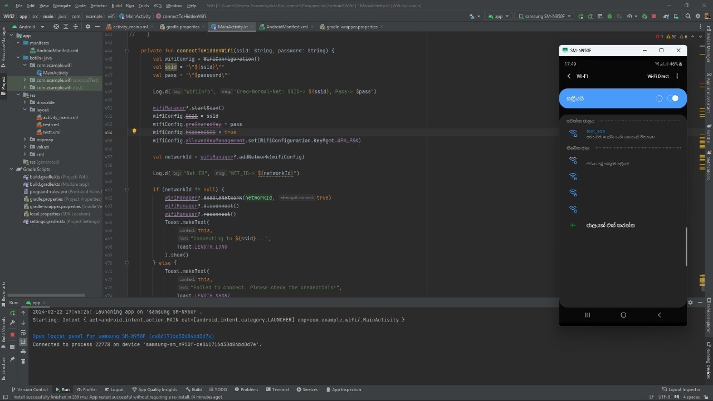

# Wi-Fi Manager App

## Introduction

Welcome to the Wi-Fi Manager App, an Android application developed in Kotlin using Android Studio. This app allows users to scan and connect to available Wi-Fi networks, including hidden ones. It provides a user-friendly interface to manage Wi-Fi connections efficiently.



## Table of Contents

- [Features](#features)
- [Permissions](#permissions)
- [Getting Started](#getting-started)
- [Usage](#usage)
- [Screenshots](#screenshots)
- [Contributing](#contributing)
- [License](#license)

## Features

- Scan and display available Wi-Fi networks.
- Connect to both visible and hidden Wi-Fi networks.
- Disconnect and forget Wi-Fi networks.
- View and connect to secured networks with a password.
- User-friendly dialogs for network operations.

## Permissions

The app requires the following permissions to function properly:

- `ACCESS_COARSE_LOCATION`: To scan for available Wi-Fi networks.
- `ACCESS_FINE_LOCATION`: To scan for fine-grained location information.
- `ACCESS_WIFI_STATE`: To access information about Wi-Fi networks.
- `CHANGE_WIFI_STATE`: To change the state of Wi-Fi (enable/disable).

## Getting Started

1. **Clone the Repository:**
   ```bash
   https://github.com/newan0805/Connecting-to-Hidden-Wi-Fi-Networks.git
